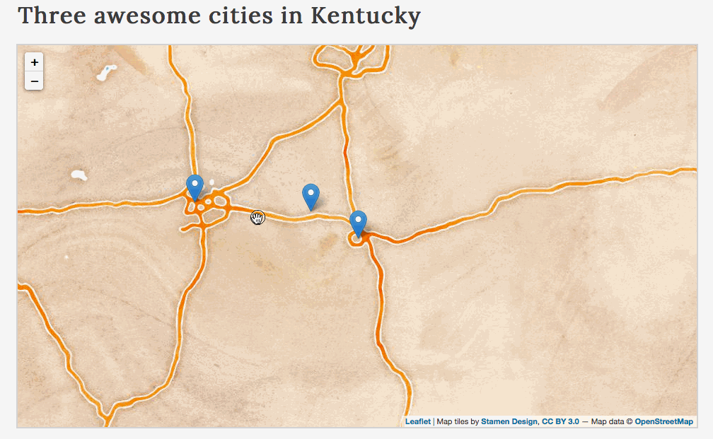
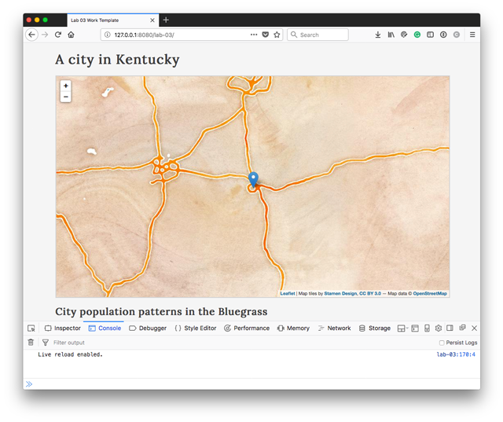

# Lab 02: Adding Markers for City Locations with Population Data

## Part I. Understanding the lesson (1 point)

Run through the lesson *README.md* and use the *lesson-02/index.html* file to write/execute/test the statements presented in the lesson. Commit changes as you go and push the *index.html* to your GitHub repository. Provide comments describing what the code is doing.


## Part II. Lesson Quiz (2 point quiz)

Create a new file named *quiz-02.md* within your *map672-module-02-username/lab-02/* directory.

Answer the following questions and save them to the *quiz-02.md* file. Commit the file to your repository with a good commit message. Again, practice using [Markdown](https://github.com/adam-p/markdown-here/wiki/Markdown-Cheatsheet) to format your responses.

### Quiz:

 1. Describe one implication of values having different data types.
 2. Explain why the output of the following statement is 88. `console.log(3 + 5 + "8");`.
 3. We know that JavaScript can interpret the numeric value of `5` to be equivalent to the string value of `"5"`. But then why does the following statement throw an error in the script? `console.log(5 = "5");`.
 4. Use this array ```var myMap = ["map","thousand","is","A","worth","a","pictures","."];``` to write a statement (using the array's index values) that unscrambles this sentence and outputs it to the Console.

## Part III. Storing and accessing map information using variables and arrays (5 points)

**Instructions:** Modify the *index.html* within the *lab-02/* directory to fulfill the requirements listed below. The goal of this lab is to create three markers on the map for three different cities (anywhere in the world) and provide information about those cities with a tooltip.

The final solution should look like this (with your own geography of interest and a meaningful yet fun title and subtitle!):

  
**Figure 01.** Solution for Lab 02.

The *lab-02/index.html* file contains some Leaflet code that you may not recognize yet, which is okay. For example, this code snippet covers JavaScript methods we haven't introduced yet:

```javascript
// create the Leaflet marker using the coordinates
L.marker(coords[0])
    .addTo(map) // add it to the map
    .bindTooltip(city1Tooltip);  // bind the tooltip
```

Here we're black boxing the [Leaflet code](http://leafletjs.com/reference-1.3.0.html) that makes the map work, for now, so we can focus on the JavaScript fundamentals.

To begin editing the code, open the *module-02/* directory using your text editor (e.g., Atom). Open the *lab-02/index.html* file, and view the rendered page within your web browser (e.g., Chrome) **using a local server**. You should see a single city, Lexington, represented by a marker (with an active tooltip).

You should also open your web developer toolbar and check the Console for any errors.

  
**Figure 02.** The starter template for lab 02.

Review the JavaScript code between the two `<script></script>` tags at the bottom of the document.

The first four statements involve creating the Leafet map with some basemap tiles. You won't be editing this, except for adjusting the center lat/lon values and the zoom level in the options:

```javascript
  // map options
  var options = {
      center: [38.0489, -84.5025], // adjust this to be the center of your map
      zoom: 8  // adjust the zoom level so all your markers are visible
  }

  // create Leaflet map
  var map = L.map('map', options);

  // request some slippy map tiles
  var tiles = L.tileLayer('http://stamen-tiles-{s}.a.ssl.fastly.net/watercolor/{z}/{x}/{y}.{ext}', {
      attribution: 'Map tiles by <a href="http://stamen.com">Stamen Design</a>, <a href="http://creativecommons.org/licenses/by/3.0">CC BY 3.0</a> &mdash; Map data &copy; <a href="http://www.openstreetmap.org/copyright">OpenStreetMap</a>',
      subdomains: 'abcd',
      minZoom: 1,
      maxZoom: 16,
      ext: 'png'
  });

  // add tiles to the map
  map.addLayer(tiles);
  ```

  Next, we write several variables, all beginning with 'city1' and assigned various values. Note that we're not writing `var` for each one, because they are all separated by commas:

  ```javascript
// variables referencing data values
var city1Name = "Lexington", // string value
    city1Coords = [38.0297, -84.4947],  // array value
    city1Pop = 308428,  // numeric value
    city1Capital = false,  // boolean value
    city1State = "Kentucky";  // string value
```

Then, we create five arrays, each containing a variable from above as the zero index (the first item in the array):

```javascript
// arrays of data
var cities = [city1Name],  // city1Name is the zero index of the array
    coords = [city1Coords],
    populations = [city1Pop],
    capitals = [city1Capital],
    states = [city1State];
```

We then build a string containing HTML elements and text, which we'll use for the tooltip content. See how we access the values using the arrays' zero index value:

```javascript
// creating a string of the tooltip content
var city1Tooltip = "<b>" + cities[0] + "</b>" +
    "<br><b>population</b>: " + populations[0];
```

For greater clarification, you could see what values the arrays are accessing with a console.log() statement:

```javascript
console.log(cities[0]);  // Lexington
console.log(populations[0]); // 308428

// creating a string of the tooltip content
var city1Tooltip = "<b>" + cities[0] + "</b>" +
    "<br><b>population</b>: " + populations[0];
```

We use an if statement to determine if the city is a capital city, and if so, we concatenate more information to that string using the `+=` operator:

```javascript
// if city is a capital city
if (capitals[0] == true) {
    // concatenate a string to the existing string value
    city1Tooltip += "<br>Capital of " + states[0];
}
```

Finally, we create our Leaflet marker, using the coordinates for the city from the `coords` array we created above:

```javascript
// create the Leaflet marker using the coordinates
L.marker(coords[0])
    .addTo(map) // add it to the map
    .bindTooltip(city1Tooltip);  // bind the tooltip
```

Your task is to modify this working example to meet the following requirements:

- [ ] Map contains at least three markers for different cities (anywhere in the world, within or across different states/countries)
- [ ] Map initially loads with all markers visible (i.e., the map center and zoom levels have been adjusted appropriately)
- [ ] Markers have tooltips (`.bindTooltip('string')`) or popups `.bindPopup('string')`) that display:
  - [ ] name of the city
  - [ ] population of the city
  - [ ] (if) the city is a capital city
- [ ] Map title, subtitle, map info, and meta data (author, source) are updated
- [ ] JavaScript code is appropriately commented (follow the template comments as an example)
- [ ] Project is documented within Git using descriptive commit messages

**How to proceed:**

1. Begin by choosing your three cities of interest and compiling the necessary data: lat/lon values, the county/state/country it's in, etc.
2. Update the existing `city1` variables with data from one of the cities.
3. Add two more sets of data and begin those variable names with `city2` and `city3` (e.g., `city2Name = "Newark"`).
4. Add those two sets of variables to the existing five arrays (city2 in the first index and city3 in the second index).
5. Replicate the blocks of code that build the tooltip information as a string, test to see if it's a capital, and create the Leaflet marker, for the other two cities.

Develop with your Console open in your browser's web developer tools. Make commits with useful messages as you hit milestones within the task, and push to the remote repository for periodic backups and to submit through Canvas when complete.

**Challenges:**

* modify the style rules of the document (within the `<script></script>` tags at top) to give the overall page a unique style (e.g., typeface, colors, hierarchy) appropriate to the mapped geography
* include an image or graphic in the HTML text below the map to help illustrate the nature of the mapped phenomena or intended message
* include an image or graphic in the tooltip/popups (hint: use the `` tag when constructing the tooltip's string value)

## Part IV. Adding markers to your Hometown Map (2 points)

Revisit your `hometown-map` repo and add at least two markers of significant locations in your city. Make sure you complete the following:

1. Declare variables for the `coords`, `locationName`, and `locationDetails` for each location.
2. Build a marker tooltip/popup using the name and details for each city.

Use the following example code to build your tooltip/popup:

```javascript
// Location marker code example
var location1Tooltip = "<b>" + location1Name + "</b><br>" +
    "<b>Details</b>: " + location1Details;

L.marker(coords[0]).addTo(map)
  .bindTooltip(location1Tooltip);
```
3. Add comments explaining what statements are doing

### Challenge

In your `locationDetails` variables, add an `` element that shows an appropriate photograph or graphic of your location.

Commit and push your final solutions to your remote repository and provide a link to your repository within Canvas by the due date.
