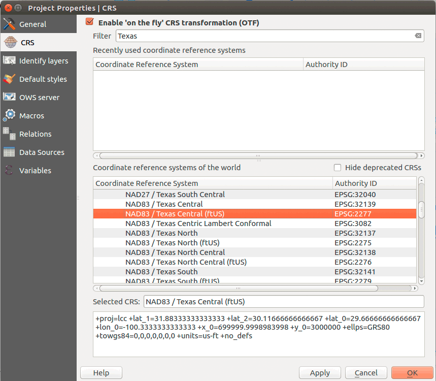

# Module 03 Lab Assignment

## Table of Contents

<!-- TOC -->

- [Module 03 Lab Assignment](#module-03-lab-assignment)
    - [Table of Contents](#table-of-contents)
    - [Overview](#overview)
    - [Data files](#data-files)
    - [Create a web page map of your home state waterways](#create-a-web-page-map-of-your-home-state-waterways)
        - [Required specifications of the deliverable](#required-specifications-of-the-deliverable)
        - [Submission](#submission)
    - [Example](#example)
    - [Challenge](#challenge)

<!-- /TOC -->

## Overview

Your contract with HydroTime has moved to phase two. They are interested in visualizing the stream networks in your hometown's state. Your contract specifies that you need to make a web page that shows the streams with an option to look at a high resolution version of the map. 

The requirements of the map are listed below. You will submit all deliverables to the Canvas assignment page. All the tasks required to fulfill this assignment are documented within Module 03.

## Data files

Use the layers you created in the last lab. The should be available from your PostGIS database or from the GeoJSONs you created. Please don't add duplicate copies of GeoJSONs to work on this module.

## Create a web page map of your home state waterways

Apply the skills learned in the lesson to the data you created in the last module.

### Required specifications of the deliverable

1) The final map must fulfill the following requirements (6 pts)

* The map must display the full extent of state selected to map.
* Lakes must be shown and symbolized appropriately.
* Streams must be symbolized by stream order, where higher order streams have larger line widths.
* Urban areas need to be shown.
* The style of your map layers and layout are up to you, but please observe intuitive color schemes. Consult [using colors on thematic maps](http://axismaps.github.io/thematic-cartography/articles/color_schemes.html) and general guidelines with [ColorBrewer](http://colorbrewer2.org/).
* Map must have a meaningful title, an appropriate legend, and scale bar.
* Map page must include metadata information including the source and the projection information
* An appropriate coordinate reference system must used for the map and you'll need enable **Project Projects > CRS > Enable 'on-the-fly' CRS transformation** or project each layer during a **Save As..**. Finding an acceptable CRS for your state will take a little research (because many exist), but it is essential you know at least one. For mapping larger areas like continents, it is easier to select a CRS because we have an smaller but established set.

Changing coordinate reference systems is pretty easy. In your QGIS **Project Properties > CRS** you can search for the "Florida NAD83" projected coordinate system definition, which is appropriate for these states. For example, if you wanted to find an appropriate CRS for Texas, you can search QGIS for State Plane versions with NAD83 datum and US ft as units:

    
Figure 1: Search for CRS for Texas in QGIS

This selects a State Plane CRS (SPCS) for Central Texas using US feet as units. Each US state will have at least one SPCS and most states have multiple versions that are tuned to a specific region of the state. Pick one that gives a balanced representation for your state. These local CRS should always be used when making small area maps. The goal is minimize map distortion so we can accurately display features. You could also use [UTM zones](https://en.wikipedia.org/wiki/Universal_Transverse_Mercator_coordinate_system) or even create your own projection with [Flex Projector](http://www.flexprojector.com/about.html).

Many CRS are nearly duplications. Notice the SPCS shown below has the projection parameters (though in slightly different order with slightly different values) but a different EPSG code, EPSG: 2277 (above) versus EPSG: 102738 (below).

    
Figure 2: Search for CRS for Texas in QGIS

Search [EPSG.io](https://epsg.io) and [SpatialReference.org](http://spatialreference.org/) for help understanding EPSG codes, which is the predominate way of specifying a CRS. If you need more background about selecting a CRS, please find the reading as PDF in the Canvas module.

2) The client has requested a web page that shows the map with link to a higher resolution version. This web page map must meet the following requirements (4 pts)

* Map needs to be in two resolutions: 1) width of 1,200 px and 2) width of 8,000 px
* Follow the lesson to learn how to format a web page.
* Map image format should be a PNG.
* A link must be available to access the higher resolution version.
* The web page must have must have a meaningful title (both in the header element and in the h1 element) and metadata about the author, data source, and brief description of purpose.
* Contact information in footer must be tuned to you, the author.
* The map page must be called "index.html" in a folder called "waterways" in your _lab-03_ folder.

### Submission

Paste the URL for completed lesson module within the Canvas, e.g., *https://github.com/newmapsplus/map671-module-03-username*

## Example

    
Figure 3: Example web page with map

## Challenge

Make your page elements adapt to different screen sizes, i.e., make your page with a [responsive web design](https://www.w3schools.com/html/html_responsive.asp). Then, add this page to your *hometown-map* repo in a folder called "waterways" (e.g., *https://username.github.io/hometown-map/waterways*) and provide a link to this page from the repository home page.
